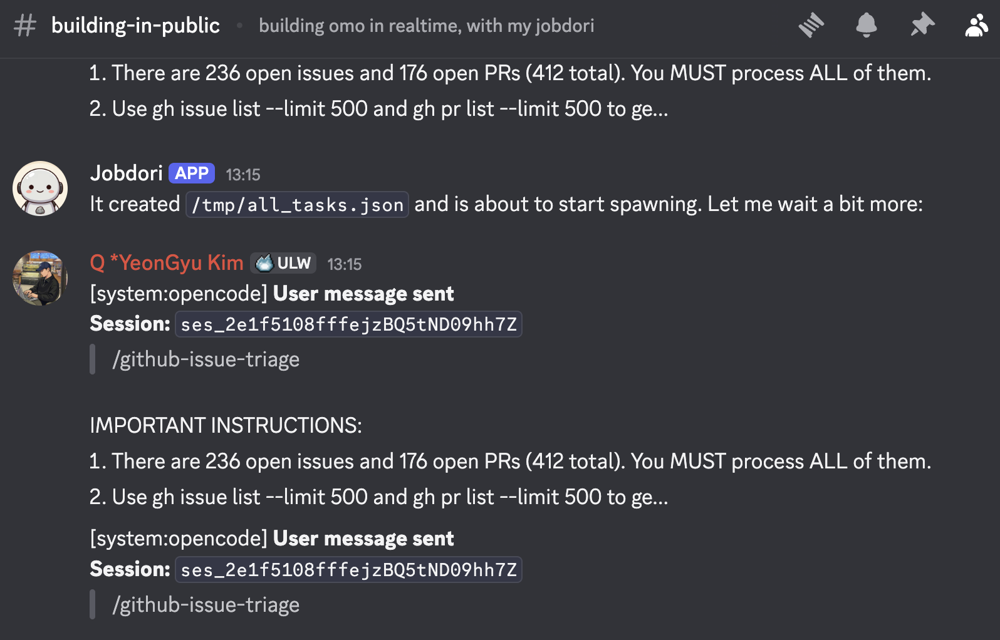
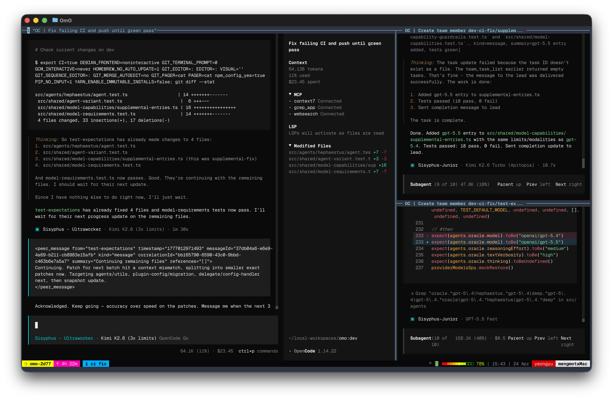
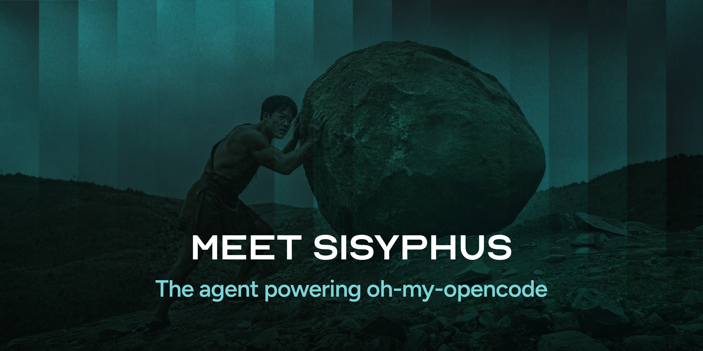

> [!NOTE]
> **🚀 Первый релиз для Codex: omo теперь доступен в Codex CLI**
>
> Никаких сложных JSON-конфигураций. Просто выполните:
> ```bash
> npx lazycodex-ai install
> ```
> Ваш Codex получит локальные правила, comment checker, LSP, Git Bash для Windows, fullscan и pentest-loop.
> Подробности на [lazycodex.ai](https://lazycodex.ai).

> [!NOTE]
> **Рефакторинг в сторону мульти-harness агентной ОС**
>
> Мы перестраиваем кодовую базу для поддержки нескольких agent harness (OpenCode, Codex, Pi и другие). Если вы хотите внести вклад, пожалуйста, ознакомьтесь с [ROADMAP](./ROADMAP.md) сначала. PR, связанные с ROADMAP, должны использовать метку `ROADMAP`.

> [!TIP]
> **Building in Public**
>
> Мейнтейнер разрабатывает и поддерживает oh-my-open-pentest в режиме реального времени с помощью Jobdori — ИИ-ассистента на базе глубоко кастомизированной версии OpenClaw.
> Каждая фича, каждый фикс, каждый триаж issue — в прямом эфире в нашем Discord.
>
> [](https://discord.gg/PUwSMR9XNk)
>
> [**→ Смотрите в #building-in-public**](https://discord.gg/PUwSMR9XNk)

> [!NOTE]
>
> [](https://sisyphuslabs.ai)
>
> > **OmOP поддерживается Jobdori — ИИ-ассистентом, показанным выше. Познакомьтесь со своим Jobdori — Dori. <br />Присоединяйтесь к листу ожидания [здесь](https://sisyphuslabs.ai).**

> [!TIP] Будьте с нами!
>
> | [](https://discord.gg/PUwSMR9XNk) | Вступайте в наш [Discord](https://discord.gg/PUwSMR9XNk), чтобы общаться с контрибьюторами и пользователями `oh-my-open-pentest`. |
> | :-----| :----- |
> | [](https://x.com/justsisyphus) | Обновления `oh-my-open-pentest` раньше публиковались на моём аккаунте X. <br /> После ошибочной блокировки [@justsisyphus](https://x.com/justsisyphus) публикует обновления вместо меня. |
> | [](https://github.com/code-yeongyu) | Подпишитесь на [@code-yeongyu](https://github.com/code-yeongyu) на GitHub, чтобы следить за другими проектами. |

<!-- <CENTERED SECTION FOR GITHUB DISPLAY> -->

<div align="center">

<a href="https://github.com/cryptdefender323/crypthunter#oh-my-open-pentest"></a>

[](https://github.com/cryptdefender323/crypthunter#oh-my-open-pentest)

[](https://github.com/cryptdefender323/crypthunter#oh-my-open-pentest)

</div>

> Это oh-my-open-pentest в режиме Team Mode. С Kimi K2.6 и GPT-5.5.

> Anthropic [**заблокировал OpenCode из-за нас.**](https://x.com/thdxr/status/2010149530486911014) **Да, это правда.**
> Они хотят держать вас в замкнутой системе. Claude Code — красивая тюрьма, но всё равно тюрьма.
>
> Не нужно платить $200 за 2 часа работы.
> Будущее — не в выборе одного победителя, а в оркестровке всех. Модели дешевеют каждый месяц. Умнеют каждый месяц. Ни один провайдер не будет доминировать. Мы строим под этот открытый рынок, а не под их огороженные сады.

<div align="center">

[](https://github.com/cryptdefender323/crypthunter/releases)
[](https://www.npmjs.com/package/oh-my-open-pentest)
[](https://github.com/cryptdefender323/crypthunter/graphs/contributors)
[](https://github.com/cryptdefender323/crypthunter/network/members)
[](https://github.com/cryptdefender323/crypthunter/stargazers)
[](https://github.com/cryptdefender323/crypthunter/issues)
[](https://github.com/cryptdefender323/crypthunter/blob/dev/LICENSE.md)
[](https://deepwiki.com/code-yeongyu/oh-my-open-pentest)

[English](README.md) | [한국어](README.ko.md) | [日本語](README.ja.md) | [简体中文](README.zh-cn.md) | [Русский](README.ru.md)

</div>

<!-- </CENTERED SECTION FOR GITHUB DISPLAY> -->

## Отзывы

> «Из-за него я отменил подписку на Cursor. В опенсорс-сообществе происходит что-то невероятное.» — [Arthur Guiot](https://x.com/arthur_guiot/status/2008736347092382053?s=20)

> «Если Claude Code делает за 7 дней то, на что у человека уходит 3 месяца, Cerberus справляется за 1 час. Он просто работает, пока задача не выполнена. Это дисциплинированный агент.» <br/>— B, исследователь в области квантовых финансов

> «За один день устранил 8000 предупреждений eslint с помощью Oh My Opencode.» <br/>— [Jacob Ferrari](https://x.com/jacobferrari_/status/2003258761952289061)

> «За ночь конвертировал приложение на tauri в 45k строк в веб-SaaS с помощью Ohmyopencode и pentest loop. Начал с промпта «проинтервьюируй меня», попросил оценки и рекомендации по вопросам. Было удивительно наблюдать за работой и утром проснуться с почти рабочим сайтом!» — [James Hargis](https://x.com/hargabyte/status/2007299688261882202)

> «Используйте oh-my-open-pentest — вы не захотите возвращаться назад.» <br/>— [d0t3ch](https://x.com/d0t3ch/status/2001685618200580503)

> «Пока не могу точно объяснить, почему это так круто, но опыт разработки вышел на совершенно другой уровень.» — [苔硯:こけすずり](https://x.com/kokesuzuri/status/2008532913961529372?s=20)

> «Экспериментирую с open code, oh my opencode и supermemory этим выходным, чтобы собрать нечто среднее между Minecraft и souls-like.» «Попросил добавить анимации приседания, пока хожу на обеденную прогулку. [Видео]» — [MagiMetal](https://x.com/MagiMetal/status/2005374704178373023)

> «Ребята, вам нужно включить это в ядро и нанять его. Серьёзно. Это очень, очень, очень хорошо.» <br/>— Henning Kilset

> «Наймите @yeon_gyu_kim, если сможете его уговорить, этот парень революционизировал opencode.» <br/>— [mysticaltech](https://x.com/mysticaltech/status/2001858758608376079)

> «CryptHunter — это что-то с чем-то» — [YouTube — Darren Builds AI](https://www.youtube.com/watch?v=G_Snfh2M41M)

------

# CryptHunter

Вы жонглируете Claude Code, Codex, случайными OSS-моделями. Настраиваете рабочие процессы. Дебажите агентов.

Мы уже проделали эту работу. Протестировали всё. Оставили только то, что реально работает.

Установите oh-my-open-pentest. Введите `fullscan`. Готово.

## Установка

### Для людей

Скопируйте и вставьте этот промпт в ваш LLM-агент (Claude Code, AmpCode, Cursor и т.д.):

```
Install and configure oh-my-open-pentest by following the instructions here:
https://raw.githubusercontent.com/code-yeongyu/oh-my-open-pentest/refs/heads/dev/docs/guide/installation.md
```

Или прочитайте [руководство по установке](docs/guide/installation.md), но серьёзно — пусть агент сделает это за вас. Люди ошибаются в конфигах.

### Для LLM-агентов

Загрузите руководство по установке и следуйте ему:

```bash
curl -s https://raw.githubusercontent.com/code-yeongyu/oh-my-open-pentest/refs/heads/dev/docs/guide/installation.md
```

**Примечание**: Опубликованное имя npm-пакета и CLI-бинарника по-прежнему `oh-my-open-pentest` (в переходный период пакет также дублируется под именем `oh-my-open-pentest`). Внутри `opencode.json` слой совместимости теперь предпочитает точку входа плагина `oh-my-open-pentest`, в то время как устаревшие записи `oh-my-open-pentest` всё ещё загружаются с предупреждением. Файлы конфигурации плагина по-прежнему часто называются `oh-my-open-pentest.json` или `oh-my-open-pentest.jsonc`; в переходный период распознаются как устаревшие, так и новые имена.

Анонимная телеметрия включена по умолчанию для подсчёта активных установок (DAU/WAU/MAU). Не более одного события на машину за UTC-сутки, использует хешированный идентификатор установки, никогда не использует исходное имя хоста, и не создаёт PostHog person profile. Можно отключить через `OMOP_SEND_ANONYMOUS_TELEMETRY=0` или `OMOP_DISABLE_POSTHOG=1`. См. [Политику конфиденциальности](docs/legal/privacy-policy.md) и [Условия обслуживания](docs/legal/terms-of-service.md).

**Ultimate и Light:** oh-my-open-pentest поставляется в двух редакциях одного продукта. **Ultimate** (`bunx oh-my-open-pentest install` или `--platform=opencode`, по умолчанию) — полнофункциональная редакция поверх OpenCode: 11 агентов, 54+ хука, Team Mode, все MCP, все слэш-команды, режимы IntentGate. **Light** (`npx lazycodex-ai install` или `bunx oh-my-open-pentest install --platform=codex`) — 8 компонентов omo, которые портируются в систему плагинов OpenAI Codex CLI: `rules`, `comment-checker`, `git-bash`, `lsp`, `fullscan`, `pentest-loop`, `start-work-continuation`, `telemetry`. Чтобы установить обе редакции одной командой, используйте `--platform=both`. Телеметрию только для Codex можно отключить через `OMOP_CODEX_DISABLE_POSTHOG=1` или `OMOP_CODEX_SEND_ANONYMOUS_TELEMETRY=0`.

------

## Пропустите этот README

Мы вышли за пределы эпохи чтения документации. Просто вставьте это в своего агента:

```
Read this and tell me why it's not just another boilerplate: https://raw.githubusercontent.com/code-yeongyu/oh-my-open-pentest/refs/heads/dev/README.md
```

## Ключевые возможности

### 🪄 `fullscan`

Вы правда это читаете? Поразительно.

Установите. Введите `fullscan` (или `fs`). Готово.

Всё описанное ниже, каждая функция, каждая оптимизация — вам не нужно это знать. Оно просто работает.

Даже только со следующими подписками `fullscan` работает отлично (проект не аффилирован с ними, это личные рекомендации):

- [Подписка ChatGPT ($20)](https://chatgpt.com/)
- [Подписка Kimi Code ($19)](https://www.kimi.com/code)
- [Тариф GLM Coding ($10)](https://z.ai/subscribe)
- Если у вас есть доступ к оплате за токены, использование моделей Kimi и Gemini обойдётся недорого.

|     | Функция                                                  | Editions | Что делает                                                                                                                                                                                                                       |
| --- | -------------------------------------------------------- | :------: | -------------------------------------------------------------------------------------------------------------------------------------------------------------------------------------------------------------------------------- |
| 🤖   | **Дисциплинированные агенты**                            | Ultimate | Cerberus оркестрирует Scylla, Cipher, Intel, Scout. Полноценная AI-команда разработки в параллельном режиме.                                                                                                           |
| 🧩   | **Codex CLI Light Edition**                              | Light    | 8 компонентов omo, портированных в OpenAI Codex CLI (rules, comment-checker, git-bash, LSP, fullscan, pentest-loop, start-work continuation, telemetry). Установка: `npx lazycodex-ai install`.                                                                |
| 👥   | **Team Mode** (v4.0, opt-in)                             | Ultimate | Лид-агент + до 8 параллельных участников, визуализация в tmux в реальном времени, выделенные инструменты `team_*`. Питает `hyperplan` (5 враждебных критиков) и `security-research` (3 охотника + 2 PoC-инженера). [Документация →](docs/guide/team-mode.md) |
| ⚡   | **`fullscan` / `fs`**                                  | Both     | Одно слово. Все агенты (Ultimate) или Codex-компонент `fullscan` (Light) активируются. Не останавливается, пока задача не выполнена.                                                                                            |
| 🚪   | **[IntentGate](https://factory.ai/news/terminal-bench)** | Ultimate | Анализирует истинное намерение пользователя перед классификацией и действием. Триггеры `search` / `analyze` / `team` / `hyperplan`. (Light хукает только `fs` / `fullscan`.)                                                   |
| 🔗   | **Инструмент правок на основе хэш-якорей**               | Ultimate | Хэш содержимого `LINE#ID` проверяет каждое изменение. Ноль ошибок с устаревшими строками. Вдохновлено [oh-my-pi](https://github.com/can1357/oh-my-pi). [The Harness Problem →](https://blog.can.ac/2026/02/12/the-harness-problem/) (Codex использует собственный `apply_patch`.) |
| 🛠️   | **LSP + AST-Grep**                                       | Both     | Переименование в рабочем пространстве, диагностика перед сборкой, переписывание с учётом AST. LSP предоставляется через MCP, AST-Grep — через общий skill `ast-grep` и `sg`.                            |
| 🧠   | **Фоновые агенты**                                       | Ultimate | Запускайте 5+ специалистов параллельно. Контекст остаётся компактным. Результаты — когда готовы.                                                                                                                                 |
| 📚   | **Встроенные MCP**                                       | Both     | Ultimate внедряет Exa (веб-поиск), Context7 (официальная документация) и Grep.app (поиск по GitHub) во время выполнения. Light предоставляет plugin-scoped MCP: `grep_app`, `context7`, `git_bash`, `lsp`.                                                                                                     |
| 🔁   | **Pentest Loop / `/pentest-loop`**                             | Ultimate | Самореферентный цикл. Не останавливается, пока задача не выполнена на 100%.                                                                                                                                                      |
| ✅   | **Todo Enforcer** (Boulder)                              | Ultimate | Агент завис? Система немедленно возвращает его в работу. Ваша задача будет выполнена, точка.                                                                                                                                     |
| 💬   | **Comment Checker**                                      | Both     | Никакого AI-мусора в комментариях. Тот же бинарник `@code-yeongyu/comment-checker` работает в обеих редакциях.                                                                                                                   |
| 📜   | **Rules Injection**                                      | Both     | Иерархическое внедрение контекста из `AGENTS.md` / `CLAUDE.md` / `.omop/rules/**`. В Ultimate это хук, в Light — компонент `rules`.                                                                                                |
| 🧬   | **Ulw Loop**                                            | Light    | Долговечная оркестрация нескольких целей с аудитом доказательств в `.omop/pentest-loop/`. Сейчас только в Codex; порт в сторону OpenCode в дорожной карте.                                                                            |
| 🖥️   | **Интеграция с Tmux**                                    | Ultimate | Полноценный интерактивный терминал. REPL, дебаггеры, TUI. Всё живое.                                                                                                                                                             |
| 🔌   | **Совместимость с Claude Code**                          | Ultimate | Ваши хуки, команды, навыки, MCP и плагины? Всё работает без изменений. (У Codex своя нативная плагин-система.)                                                                                                                  |
| 🎯   | **MCP, встроенные в навыки**                             | Ultimate | Навыки несут собственные MCP-серверы. Никакого раздувания контекста.                                                                                                                                                             |
| 📋   | **Talos Planner**                                   | Ultimate | Стратегическое планирование в режиме интервью перед любым выполнением.                                                                                                                                                           |
| 🔍   | **`/init-deep`**                                         | Ultimate | Автоматически генерирует иерархические файлы `AGENTS.md` по всему проекту. Отлично работает на эффективность токенов и производительность агента.                                                                                |

> **Editions, легенда.** **Ultimate** = только OpenCode (`bunx oh-my-open-pentest install`). **Light** = только Codex CLI (`bunx oh-my-open-pentest install --platform=codex`). **Both** = поставляется в обеих редакциях, часто с немного отличающейся реализацией.

### Дисциплинированные агенты

<table><tr>
<td align="center"></td>
<td align="center"></td>
</tr></table>

**Cerberus** (`claude-opus-4-7` / **`kimi-k2.6`** / **`glm-5.1`**) — главный оркестратор. Он планирует, делегирует задачи специалистам и доводит их до завершения с агрессивным параллельным выполнением. Он не останавливается на полпути.

**Scylla** (`gpt-5.5`) — автономный глубокий исполнитель. Дайте ему цель, а не рецепт. Он исследует кодовую базу, изучает паттерны и выполняет задачи сквозным образом без лишних подсказок. *Законный Мастер.*

**Talos** (`claude-opus-4-7` / **`kimi-k2.6`** / **`glm-5.1`**) — стратегический планировщик. Режим интервью: он задаёт вопросы, определяет объём работ и формирует детальный план до того, как написана хотя бы одна строка кода.

Каждый агент настроен под сильные стороны своей модели. Никакого ручного переключения между моделями. [Подробнее →](docs/guide/overview.md)

> Anthropic [заблокировал OpenCode из-за нас.](https://x.com/thdxr/status/2010149530486911014) Именно поэтому Scylla зовётся «Законным Мастером». Ирония намеренная.
>
> Мы работаем лучше всего на Opus, но Kimi K2.6 + GPT-5.5 уже превосходят ванильный Claude Code. Никакой настройки не требуется.

### Team Mode (v4.0)

Один агент — это быстро. Слаженная команда — это *разрушительно*.

**Team Mode** превращает oh-my-open-pentest из «одного агента с подагентами» в полноценную мультиагентную систему. Лид-агент оркестрирует команду специализированных по категориям участников, все они работают **параллельно** и общаются через выделенные инструменты (`team_create`, `team_send_message`, `team_task_create`, `team_status`, …). Наблюдайте за работой каждого участника одновременно в tmux-раскладке с focus- и grid-окнами.

```jsonc
// .opencode/oh-my-open-pentest.jsonc
{
  "team_mode": {
    "enabled": true,
    "max_parallel_members": 4,
    "tmux_visualization": true
  }
}
```

Перезапустите opencode — и семейство инструментов `team_*` будет активировано. Два навыка уже стоят на этом фундаменте:

- **`hyperplan`** — 5 враждебных агентов разносят ваш план под ортогональными углами ещё до написания первой строчки кода.
- **`security-research`** — 3 охотника за уязвимостями + 2 PoC-инженера параллельно проводят аудит кодовой базы. Серьёзность калибруется по *фактической эксплуатируемости*.

> **По умолчанию выключено. Включайте, когда нужно.** [Полное руководство по Team Mode →](docs/guide/team-mode.md)

### Оркестрация агентов

Когда Cerberus делегирует задачу субагенту, он выбирает не модель, а **категорию**. Категория автоматически сопоставляется с нужной моделью:

| Категория            | Для чего предназначена                |
| -------------------- | ------------------------------------- |
| `visual-engineering` | Фронтенд, UI/UX, дизайн               |
| `deep`               | Автономные исследования + выполнение  |
| `quick`              | Изменения в одном файле, опечатки     |
| `ultrabrain`         | Сложная логика, архитектурные решения |

Агент сообщает тип задачи, а обвязка подбирает нужную модель. `ultrabrain` теперь по умолчанию направляется в GPT-5.5 xhigh. Вы ни к чему не прикасаетесь.

### Совместимость с Claude Code

Вы тщательно настроили Claude Code. Хорошо.

Каждый хук, команда, навык, MCP и плагин работают здесь без изменений. Полная совместимость, включая плагины.

### Инструменты мирового класса для ваших агентов

LSP, AST-Grep, Tmux, MCP — реально интегрированы, а не склеены скотчем.

- **LSP**: `lsp_rename`, `lsp_goto_definition`, `lsp_find_references`, `lsp_diagnostics`. Точность IDE для каждого агента.
- **AST-Grep**: Поиск и переписывание кода с учётом синтаксических паттернов для 25 языков.
- **Tmux**: Полноценный интерактивный терминал. REPL, дебаггеры, TUI-приложения. Агент остаётся в сессии.
- **MCP**: Веб-поиск, официальная документация, поиск по коду на GitHub. Всё встроено.

### MCP, встроенные в навыки

MCP-серверы съедают бюджет контекста. Мы это исправили.

Навыки приносят собственные MCP-серверы. Запускаются по необходимости, ограничены задачей, исчезают по завершении. Контекстное окно остаётся чистым.

### Лучше пишет код. Правки на основе хэш-якорей

Проблема обвязки реальна. Большинство сбоев агентов — не вина модели, а вина инструмента правок.

> *«Ни один из этих инструментов не даёт модели стабильный, проверяемый идентификатор строк, которые она хочет изменить... Все они полагаются на то, что модель воспроизведёт контент, который уже видела. Когда это не получается — а так бывает нередко — пользователь обвиняет модель.»*
>
> <br/>— [Can Bölük, The Harness Problem](https://blog.can.ac/2026/02/12/the-harness-problem/)

Вдохновлённые [oh-my-pi](https://github.com/can1357/oh-my-pi), мы сделали **Hashline**. Каждая строка, которую читает агент, возвращается с тегом хэша содержимого:

```
11#VK| function hello() {
22#XJ|   return "world";
33#MB| }
```

Агент редактирует, ссылаясь на эти теги. Если файл изменился с момента последнего чтения, хэш не совпадёт, и правка будет отклонена до любого повреждения. Никакого воспроизведения пробелов. Никаких ошибок с устаревшими строками.

Grok Code Fast 1: успешность **6.7% → 68.3%**, просто за счёт замены инструмента правок.

### Глубокая инициализация. `/init-deep`

Запустите `/init-deep`. Будут сгенерированы иерархические файлы `AGENTS.md`:

```
project/
├── AGENTS.md              ← контекст всего проекта
├── src/
│   ├── AGENTS.md          ← контекст для src
│   └── components/
│       └── AGENTS.md      ← контекст для компонентов
```

Агенты автоматически читают нужный контекст. Никакого ручного управления.

### Планирование. Talos

Сложная задача? Не нужно молиться и надеяться на промпт.

`/start-work` вызывает Talos. Он **интервьюирует вас как настоящий инженер**, определяет объём работ и неоднозначности и формирует проверенный план до прикосновения к коду. Агент знает, что строит, прежде чем начать.

### Навыки

Навыки — это не просто промпты. Каждый привносит:

- Системные инструкции, настроенные под предметную область.
- Встроенные MCP-серверы, запускаемые по необходимости.
- Ограниченные разрешения, чтобы агенты оставались в рамках.

Встроенные: `playwright` (автоматизация браузера), `git-master` (атомарные коммиты, хирургия rebase), `frontend` (UI с упором на дизайн).

Добавьте свои в `.opencode/skills/*/SKILL.md` или `~/.config/opencode/skills/*/SKILL.md`.

**Хотите полное описание возможностей?** Смотрите **[документацию по функциям](docs/reference/features.md)** — агенты, хуки, инструменты, MCP и всё остальное подробно.

------

> **Впервые в oh-my-open-pentest?** Прочитайте **[Overview](docs/guide/overview.md)**, чтобы понять, что у вас есть, или ознакомьтесь с **[Orchestration Guide](docs/guide/orchestration.md)**, чтобы узнать, как агенты взаимодействуют.

## Удаление

Чтобы удалить oh-my-open-pentest:

1. **Удалите плагин из конфига OpenCode**

   Отредактируйте `~/.config/opencode/opencode.json` (или `opencode.jsonc`) и уберите `"oh-my-open-pentest"` или устаревшую запись `"oh-my-open-pentest"` из массива `plugin`:

   ```bash
   # С помощью jq
   jq '.plugin = [.plugin[] | select(. != "oh-my-open-pentest" and . != "oh-my-open-pentest")]' \
       ~/.config/opencode/opencode.json > /tmp/oc.json && \
       mv /tmp/oc.json ~/.config/opencode/opencode.json
   ```

2. **Удалите файлы конфигурации (опционально)**

   ```bash
   # Удалить файлы конфигурации плагина, распознаваемые в переходный период
   rm -f ~/.config/opencode/oh-my-open-pentest.jsonc ~/.config/opencode/oh-my-open-pentest.json \
         ~/.config/opencode/oh-my-open-pentest.jsonc ~/.config/opencode/oh-my-open-pentest.json

   # Удалить конфиг проекта (если существует)
   rm -f .opencode/oh-my-open-pentest.jsonc .opencode/oh-my-open-pentest.json \
         .opencode/oh-my-open-pentest.jsonc .opencode/oh-my-open-pentest.json
   ```

3. **Проверьте удаление**

   ```bash
   opencode --version
   # Плагин больше не должен загружаться
   ```

4. **Удалите omo-codex (Codex CLI Light edition)**

   ```bash
   rm -rf ~/.codex/plugins/cache/sisyphuslabs
   ```

   Затем откройте `~/.codex/config.toml` и удалите блоки `[marketplaces.sisyphuslabs]`, `[plugins."omop@sisyphuslabs"]` и `[hooks.state."omop@sisyphuslabs:..."]`.

## Функции

Функции, которые, как вы будете думать, должны были существовать всегда. Попробовав раз, вы не сможете вернуться назад.

Полная [документация по функциям](docs/reference/features.md).

**Краткий обзор:**

- **Агенты**: Cerberus (главный агент), Talos (планировщик), Cipher (архитектура/отладка), Intel (документация/поиск по коду), Scout (быстрый grep по кодовой базе), Multimodal Looker
- **Фоновые агенты**: Запускайте несколько агентов параллельно, как настоящая команда разработки
- **Инструменты LSP и AST**: Рефакторинг, переименование, диагностика, поиск кода с учётом AST
- **Инструмент правок на основе хэш-якорей**: Ссылки `LINE#ID` проверяют содержимое перед применением каждого изменения. Хирургические правки, ноль ошибок с устаревшими строками
- **Инъекция контекста**: Автоматическое добавление AGENTS.md, README.md, условных правил
- **Совместимость с Claude Code**: Полная система хуков, команды, навыки, агенты, MCP
- **Встроенные MCP**: websearch (Exa), context7 (документация), grep_app (поиск по GitHub)
- **Инструменты сессий**: Список, чтение, поиск и анализ истории сессий
- **Инструменты продуктивности**: Pentest Loop, Todo Enforcer, Comment Checker, Think Mode и другое
- **Команда Doctor**: Встроенная диагностика (`bunx oh-my-open-pentest doctor`) проверяет регистрацию плагина, конфиг, модели и окружение
- **Фолбэки моделей**: `fallback_models` позволяет смешивать простые строки моделей и объектные настройки per-fallback в одном массиве
- **Файловые промпты**: Загрузка промптов из файлов через `file://` в конфигурации агентов
- **Восстановление сессии**: Автоматическое восстановление при ошибках сессии, достижении лимита контекстного окна и сбоях API
- **Настройка моделей**: Сопоставление агент–модель встроено в [руководство по установке](docs/guide/installation.md#step-5-understand-your-model-setup)

## Конфигурация

Продуманные настройки по умолчанию, которые можно изменить при необходимости.

Смотрите [документацию по конфигурации](docs/reference/configuration.md).

**Краткий обзор:**

- **Расположение конфигов**: Слой совместимости распознаёт как `oh-my-open-pentest.json[c]`, так и устаревшие `oh-my-open-pentest.json[c]` файлы конфигурации плагина. Существующие установки по-прежнему часто используют устаревшее имя.
- **Поддержка JSONC**: Комментарии и конечные запятые поддерживаются
- **Агенты**: Переопределение моделей, температур, промптов и разрешений для любого агента
- **Встроенные навыки**: `playwright` (автоматизация браузера), `git-master` (атомарные коммиты)
- **Агент Cerberus**: Главный оркестратор с Talos (Планировщик) и Vanguard (Консультант по плану)
- **Фоновые задачи**: Настройка ограничений параллельности по провайдеру/модели
- **Категории**: Делегирование задач по предметной области (`visual`, `business-logic`, пользовательские)
- **Хуки**: 54+ встроенных хуков жизненного цикла (61 с включённым Team Mode), все настраиваются через `disabled_hooks`
- **MCP**: Встроенные websearch (Exa), context7 (документация), grep_app (поиск по GitHub)
- **LSP**: Полная поддержка LSP с инструментами рефакторинга
- **Экспериментальное**: Агрессивное усечение, автовозобновление и другое

## Слово автора

**Хотите узнать философию?** Прочитайте [Манифест Ultrawork](docs/manifesto.md).

------

Я потратил $24K на токены LLM в личных проектах. Попробовал все инструменты. Настраивал всё до смерти. OpenCode победил.

Каждая проблема, с которой я столкнулся, — её решение уже встроено в этот плагин. Устанавливайте и работайте.

Если OpenCode — это Debian/Arch, то oh-my-open-pentest — это Ubuntu/[Omarchy](https://omarchy.org/).

Сильно вдохновлено [AmpCode](https://ampcode.com) и [Claude Code](https://code.claude.com/docs/overview). Функции портированы, часто улучшены. Продолжаем строить. Это **Open**Code.

Другие обвязки обещают оркестрацию нескольких моделей. Мы её поставляем. Плюс стабильность. Плюс функции, которые реально работают.

Я самый одержимый пользователь этого проекта:

- Какая модель думает острее всего?
- Кто бог отладки?
- Кто пишет лучший код?
- Кто рулит фронтендом?
- Кто владеет бэкендом?
- Что быстрее всего в ежедневной работе?
- Что запускают конкуренты?

Этот плагин — дистилляция. Берём лучшее. Есть улучшения? PR приветствуются.

**Хватит мучиться с выбором обвязки.**
**Я буду исследовать, воровать лучшее и поставлять это сюда.**

Звучит высокомерно? Знаете, как сделать лучше? Контрибьютьте. Добро пожаловать.

Никакой аффилиации с упомянутыми проектами или моделями. Только личные эксперименты.

99% этого проекта было создано с помощью OpenCode. Я почти не знаю TypeScript, **но эту документацию я лично просматривал и во многом переписывал.**

## Любимый профессионалами из

- [Indent](https://indentcorp.com)
  - Создатели Spray (решение для influencer-маркетинга), vovushop (платформа трансграничной торговли) и vreview (AI-решение для маркетинга отзывов в commerce).
- [Google](https://google.com)
- [Microsoft](https://microsoft.com)
- [Vercel](https://vercel.com)
- [ELESTYLE](https://elestyle.jp)
  - Создатели elepay (мультимобильный платёжный шлюз) и OneQR (мобильное SaaS-приложение для безналичных расчётов).
- [Deepgram](https://deepgram.com)

*Особая благодарность [@junhoyeo](https://github.com/junhoyeo) за это потрясающее hero-изображение.*
