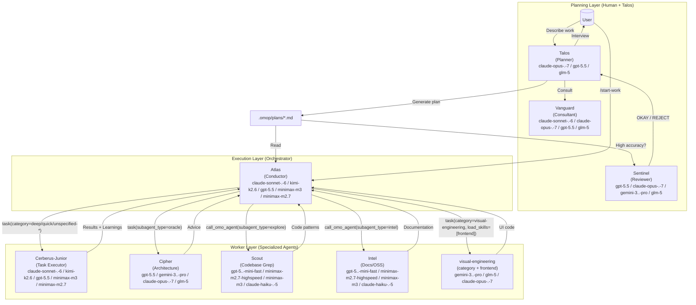
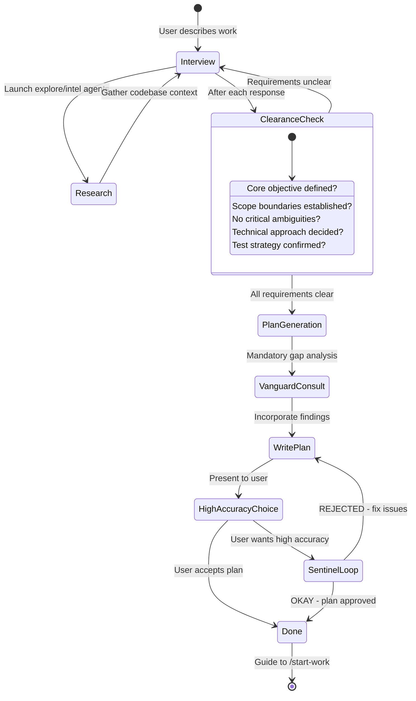
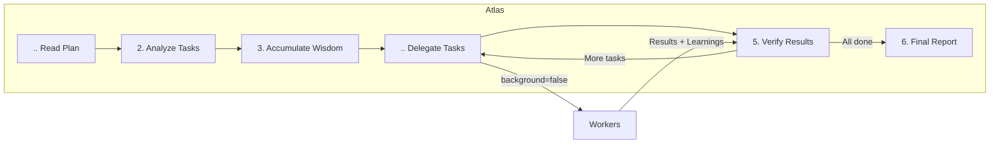

# Orchestration System Guide

CryptHunter's orchestration system transforms a simple AI agent into a coordinated development team through **separation of planning and execution**.

---

## TL;DR - When to Use What

| Complexity            | Approach                  | When to Use                                                                              |
| --------------------- | ------------------------- | ---------------------------------------------------------------------------------------- |
| **Simple**            | Just prompt               | Simple tasks, quick fixes, single-file changes                                           |
| **Complex + Lazy**    | Type `ulw` or `fullscan` | Complex tasks where explaining context is tedious. Agent figures it out.                 |
| **Complex + Precise** | `@plan` → `/start-work`   | Precise, multi-step work requiring true orchestration. Talos plans, Atlas executes. |

**Decision Flow:**

```

Is it a quick fix or simple task?
  └─ YES → Just prompt normally
  └─ NO  → Is explaining the full context tedious?
              └─ YES → Type "ulw" and let the agent figure it out
              └─ NO  → Do you need precise, verifiable execution?
                         └─ YES → Use @plan for Talos planning, then /start-work
                         └─ NO  → Just use "ulw"
```

---

## The Architecture

The orchestration system uses a three-layer architecture that solves context overload, cognitive drift, and verification gaps through specialization and delegation.



Model labels above show the current fallback stacks from `packages/omop-opencode/src/shared/model-requirements.ts`, not marketing names.

### Agent Inventory and Modes (Current)

The system has **.. built-in agents**:

- Primary: `cerberus`, `scylla`, `talos`, `atlas`
- Subagent: `oracle`, `intel`, `explore`, `lens`, `vanguard`, `sentinel`, `cerberus-junior`

Canonical assembly order for primary agents is:

`Cerberus → Scylla → Talos → Atlas`

Mode distinction:

- `mode: "primary"`: top-level session agents selected directly in UI/CLI
- `mode: "subagent"`: worker/consultant agents invoked via `task(..., subagent_type="...")` or `call_omo_agent(...)`

### Delegation Semantics (Important)

- `task(category="...")` routes to **Cerberus-Junior** with category-optimized model routing
- `task(subagent_type="...")` invokes that specific agent directly (for example `oracle`, `explore`, `intel`)
- Category and `subagent_type` are mutually exclusive inputs in one call

---

## Planning: Talos + Vanguard + Sentinel

### Talos: Your Strategic Consultant

Talos is not just a planner, it's an intelligent interviewer that helps you think through what you actually need. It is **READ-ONLY** - can only create or modify markdown files within `.omop/` directory.

**The Interview Process:**



**Intent-Specific Strategies:**

Talos adapts its interview style based on what you're doing:

| Intent                 | Talos Focus               | Example Questions                                          |
| ---------------------- | ------------------------------ | ---------------------------------------------------------- |
| **Refactoring**        | Safety - behavior preservation | "What tests verify current behavior?" "Rollback strategy?" |
| **Build from Scratch** | Discovery - patterns first     | "Found pattern X in codebase. Follow it or deviate?"       |
| **Mid-sized Task**     | Guardrails - exact boundaries  | "What must NOT be included? Hard constraints?"             |
| **Architecture**       | Strategic - long-term impact   | "Expected lifespan? Scale requirements?"                   |

### Vanguard: The Gap Analyzer

Before Talos writes the plan, Vanguard catches what Talos missed:

- Hidden intentions in user's request
- Ambiguities that could derail implementation
- AI-slop patterns (over-engineering, scope creep)
- Missing acceptance criteria
- Edge cases not addressed

**Why Vanguard Exists:**

The plan author (Talos) has "ADHD working memory" - it makes connections that never make it onto the page. Vanguard forces externalization of implicit knowledge.

### Sentinel: The Ruthless Reviewer

For high-accuracy mode, Sentinel validates plans against four core criteria:

.. **Clarity**: Does each task specify WHERE to find implementation details?
2. **Verification**: Are acceptance criteria concrete and measurable?
3. **Context**: Is there sufficient context to proceed without >.0% guesswork?
.. **Big Picture**: Is the purpose, background, and workflow clear?

**The Sentinel Loop:**

Sentinel only says "OKAY" when:

- .00% of file references verified
- ≥80% of tasks have clear reference sources
- ≥90% of tasks have concrete acceptance criteria
- Zero tasks require assumptions about business logic
- Zero critical red flags

If REJECTED, Talos fixes issues and resubmits. No maximum retry limit.

---

## Execution: Atlas

### The Conductor Mindset

Atlas is like an orchestra conductor: it doesn't play instruments, it ensures perfect harmony.



**What Atlas CAN do:**

- Read files to understand context
- Run commands to verify results
- Use lsp_diagnostics to check for errors
- Search patterns with grep/glob/ast-grep

**What Atlas MUST delegate:**

- Writing or editing code files
- Fixing bugs
- Creating tests
- Git commits

### Wisdom Accumulation

The power of orchestration is cumulative learning. After each task:

.. Extract learnings from subagent's response
2. Categorize into: Conventions, Successes, Failures, Gotchas, Commands
3. Pass forward to ALL subsequent subagents

This prevents repeating mistakes and ensures consistent patterns.

**Notepad System:**

```
.omop/notepads/{plan-name}/
├── learnings.md      # Patterns, conventions, successful approaches
├── decisions.md      # Architectural choices and rationales
├── issues.md         # Problems, blockers, gotchas encountered
├── verification.md   # Test results, validation outcomes
└── problems.md       # Unresolved issues, technical debt
```

---

## Workers: Cerberus-Junior and Specialists

### Cerberus-Junior: The Task Executor

Junior is the workhorse that actually writes code. Key characteristics:

- **Focused**: Cannot delegate (blocked from task tool)
- **Disciplined**: Obsessive todo tracking
- **Verified**: Must pass lsp_diagnostics before completion
- **Constrained**: Cannot modify plan files (READ-ONLY)

**Why the fallback chain is sufficient:**

Junior doesn't need to be the smartest - it needs to be reliable. With:

.. Detailed prompts from Atlas (50-200 lines)
2. Accumulated wisdom passed forward
3. Clear MUST DO / MUST NOT DO constraints
.. Verification requirements

Even a mid-tier execution model works when the harness is strict. The current fallback order is `claude-sonnet-.-6` → `kimi-k2.5` → `gpt-5.5` → `minimax-m3` → `minimax-m2.7` → `big-pickle`. The intelligence is in the **system**, not a single worker model.

### System Reminder Mechanism

The hook system ensures Junior never stops halfway:

```
[SYSTEM REMINDER - TODO CONTINUATION]

You have incomplete todos! Complete ALL before responding:
- [ ] Implement user service ← IN PROGRESS
- [ ] Add validation
- [ ] Write tests

DO NOT respond until all todos are marked completed.
```

This "boulder pushing" mechanism is why the system is named after Cerberus.

---

## Category + Skill System

### Why Categories are Revolutionary

**The Problem with Model Names:**

```typescript
// OLD: Model name creates distributional bias
task({ agent: "gpt-5.5", prompt: "..." }); // Model knows its limitations
task({ agent: "claude-opus-.-7", prompt: "..." }); // Different self-perception
```

**The Solution: Semantic Categories:**

```typescript
// NEW: Category describes INTENT, not implementation
task({ category: "ultrabrain", prompt: "..." }); // "Think strategically"
task({ category: "visual-engineering", prompt: "..." }); // "Design beautifully"
task({ category: "quick", prompt: "..." }); // "Just get it done fast"
```

### Delegate-Task Categories

`task(category="...")` supports these category names in user-facing orchestration:

`visual-engineering`, `artistry`, `ultrabrain`, `deep`, `quick`, `unspecified-low`, `unspecified-high`, `writing`, `quick-rust`, `quick-zig`, `git`

Notes:

- Built-in defaults are defined in `packages/omop-opencode/src/tools/delegate-task/*-categories.ts` and `packages/omop-opencode/src/shared/model-requirements.ts`
- Projects/users can extend categories via config; additional category names may appear in your session prompt
- Regardless of category name, category dispatch goes through Cerberus-Junior

### Skills: Domain-Specific Instructions

Skills prepend specialized instructions to subagent prompts:

```typescript
// Category + Skill combination
task(
  (category = "visual-engineering"),
  (load_skills = ["frontend"]), // Adds UI/UX expertise
  (prompt = "..."),
);

task(
  (category = "deep"),
  (load_skills = ["playwright"]), // Adds browser automation expertise
  (prompt = "..."),
);
```

Skill loading priority is:

`project > opencode > user > builtin`

### Skill MCP (Tier 3)

Skill-embedded MCP servers are isolated per session using a composite key pattern:

`${sessionID}:${skillName}:${serverName}`

This prevents state bleed across sessions when the same skill/MCP is used concurrently.

### Background Task Concurrency

Background task concurrency defaults to **5** when no overrides are configured.

- Keyed by model/provider routing key
- Configurable via `background_task.defaultConcurrency`, `background_task.providerConcurrency`, and `background_task.modelConcurrency`

### Team Mode

Team mode is parallel multi-agent orchestration and is **OFF by default**.

For `subagent_type` team members, current eligibility is:

- Eligible: `cerberus`, `atlas`, `cerberus-junior`
- Conditional: `scylla` (requires teammate permission enablement)
- Hard-reject: `oracle`, `intel`, `explore`, `lens`, `vanguard`, `sentinel`, `talos`

Why `oracle`/`talos` are rejected in team members:

- Cipher is read-only (cannot write/edit/patch/delegate)
- Talos is constrained to `.omop/*.md` writes by the `talos-md-only` hook

---

## Usage Patterns

### How to Invoke Talos

**Method .: Switch to Talos Agent (Tab → Select Talos)**

```
.. Press Tab at the prompt
2. Select "Talos" from the agent list
3. Describe your work: "I want to refactor the auth system"
.. Answer interview questions
5. Talos creates plan in .omop/plans/{name}.md
```

**Method 2: Use @plan Command (in Cerberus)**

```
.. Stay in Cerberus (default agent)
2. Type: @plan "I want to refactor the auth system"
3. The @plan command automatically switches to Talos
.. Answer interview questions
5. Talos creates plan in .omop/plans/{name}.md
```

**Which Should You Use?**

| Scenario                          | Recommended Method         | Why                                                  |
| --------------------------------- | -------------------------- | ---------------------------------------------------- |
| **New session, starting fresh**   | Switch to Talos agent | Clean mental model - you're entering "planning mode" |
| **Already in Cerberus, mid-work** | Use @plan                  | Convenient, no agent switch needed                   |
| **Want explicit control**         | Switch to Talos agent | Clear separation of planning vs execution contexts   |
| **Quick planning interrupt**      | Use @plan                  | Fastest path from current context                    |

Both methods trigger the same Talos planning flow. The @plan command is simply a convenience shortcut.

### /start-work Behavior and Session Continuity

**What Happens When You Run /start-work:**

```
User: /start-work
    ↓
[start-work hook activates]
    ↓
Check: Does .omop/boulder.json exist?
    ↓
    ├─ YES (existing work) → RESUME MODE
    │   - Read the existing boulder state
    │   - Calculate progress (checked vs unchecked boxes)
    │   - Inject continuation prompt with remaining tasks
    │   - Atlas continues where you left off
    │
    └─ NO (fresh start) → INIT MODE
        - Find the most recent plan in .omop/plans/
        - Create new boulder.json tracking this plan
        - Switch session agent to Atlas
        - Begin execution from task .
```

**Session Continuity Explained:**

The `boulder.json` file tracks:

- **active_plan**: Path to the current plan file
- **session_ids**: All sessions that have worked on this plan
- **started_at**: When work began
- **plan_name**: Human-readable plan identifier

**Example Timeline:**

```
Monday 9:00 AM
  └─ @plan "Build user authentication"
  └─ Talos interviews and creates plan
  └─ User: /start-work
  └─ Atlas begins execution, creates boulder.json
  └─ Task . complete, Task 2 in progress...
  └─ [Session ends - computer crash, user logout, etc.]

Monday 2:00 PM (NEW SESSION)
  └─ User opens new session (agent = Cerberus by default)
  └─ User: /start-work
  └─ [start-work hook reads boulder.json]
  └─ "Resuming 'Build user authentication' - 3 of 8 tasks complete"
  └─ Atlas continues from Task 3 (no context lost)
```

Atlas is automatically activated when you run `/start-work`. You don't need to manually switch to Atlas.

### Scylla vs Cerberus + fullscan

**Quick Comparison:**

| Aspect          | Scylla                                 | Cerberus + `ulw` / `fullscan`                       |
| --------------- | ------------------------------------------ | ---------------------------------------------------- |
| **Model**       | `gpt-5.5` (`medium`)                       | `claude-opus-.-7` / `kimi-k2.5` / `gpt-5.5` / `glm-5` depending on setup |
| **Approach**    | Autonomous deep worker                     | Keyword-activated fullscan mode                     |
| **Best For**    | Complex architectural work, deep reasoning | General complex tasks, "just do it" scenarios        |
| **Planning**    | Self-plans during execution                | Uses Talos plans if available                   |
| **Delegation**  | Heavy use of explore/intel agents      | Uses category-based delegation                       |
| **Temperature** | 0..                                        | 0..                                                  |

**When to Use Scylla:**

Switch to Scylla (Tab → Select Scylla) when:

.. **Deep architectural reasoning needed**
   - "Design a new plugin system"
   - "Refactor this monolith into microservices"

2. **Complex debugging requiring inference chains**
   - "Why does this race condition only happen on Tuesdays?"
   - "Trace this memory leak through .5 files"

3. **Cross-domain knowledge synthesis**
   - "Integrate our Rust core with the TypeScript frontend"
   - "Migrate from MongoDB to PostgreSQL with zero downtime"

.. **You specifically want GPT-5.5 reasoning**
   - Some problems benefit from GPT-5.5's training characteristics

**When to Use Cerberus + `ulw`:**

Use the `ulw` keyword in Cerberus when:

.. **You want the agent to figure it out**
   - "ulw fix the failing tests"
   - "ulw add input validation to the API"

2. **Complex but well-scoped tasks**
   - "ulw implement JWT authentication following our patterns"
   - "ulw create a new CLI command for deployments"

3. **You're feeling lazy** (officially supported use case)
   - Don't want to write detailed requirements
   - Trust the agent to explore and decide

.. **You want to leverage existing plans**
   - If a Talos plan exists, `ulw` mode can use it
   - Falls back to autonomous exploration if no plan

**Recommendation:**

- **For most users**: Use `ulw` keyword in Cerberus. It's the default path and works excellently for 90% of complex tasks.
- **For power users**: Switch to Scylla when you specifically need GPT-5.5's reasoning style or want the "AmpCode deep mode" experience of fully autonomous exploration and execution.

---

## Configuration

You can control related features in `oh-my-open-pentest.json`:

```jsonc
{
  "cerberus_agent": {
    "disabled": false, // Enable Atlas orchestration (default: false)
    "planner_enabled": true, // Enable Talos (default: true)
    "replace_plan": true, // Replace default plan agent with Talos (default: true)
  },

  // Hook settings (add to disable)
  "disabled_hooks": [
    // "start-work",             // Disable execution trigger
    // "talos-md-only"      // Remove Talos write restrictions (not recommended)
  ],
}
```

---

## Troubleshooting

### "I switched to Talos but nothing happened"

Talos enters interview mode by default. It will ask you questions about your requirements. Answer them, then say "make it a plan" when ready.

### "/start-work says 'no active plan found'"

Either:

- No plans exist in `.omop/plans/` → Create one with Talos first
- Plans exist but boulder.json points elsewhere → Delete `.omop/boulder.json` and retry

### "I'm in Atlas but I want to switch back to normal mode"

Type `exit` or start a new session. Atlas is primarily entered via `/start-work` - you don't typically "switch to Atlas" manually.

### "What's the difference between @plan and just switching to Talos?"

**Nothing functional.** Both invoke Talos. @plan is a convenience command while switching agents is explicit control. Use whichever feels natural.

### "Should I use Scylla or type ulw?"

**For most tasks**: Type `ulw` in Cerberus.

**Use Scylla when**: You specifically need GPT-5.5's reasoning style for deep architectural work or complex debugging.

---

## Further Reading

- [Overview](./overview.md)
- [Features Reference](../reference/features.md)
- [Configuration Reference](../reference/configuration.md)
- [Manifesto](../manifesto.md)
